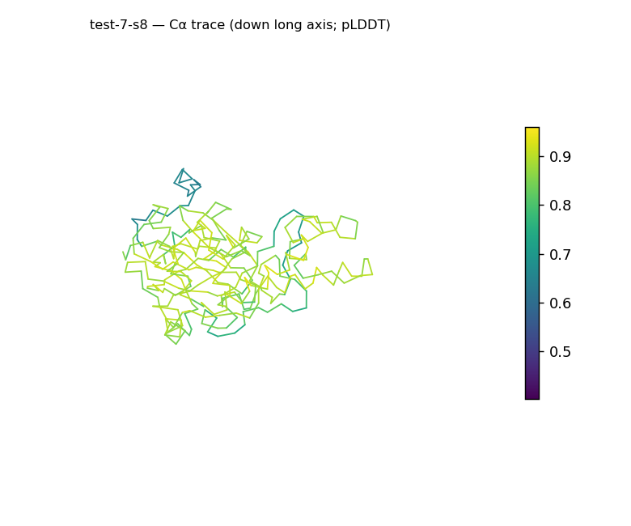
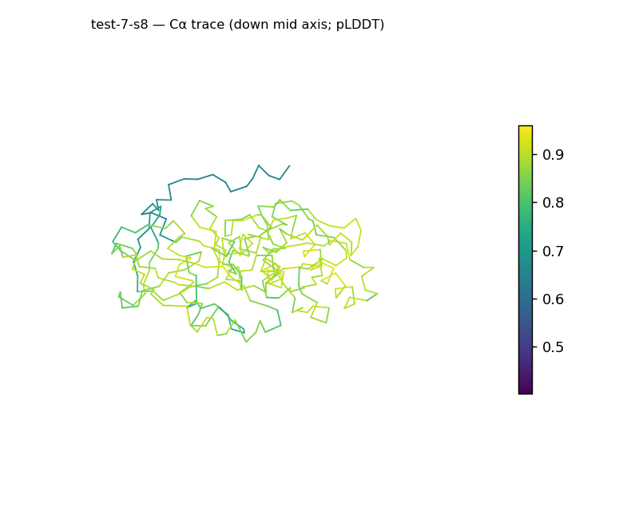
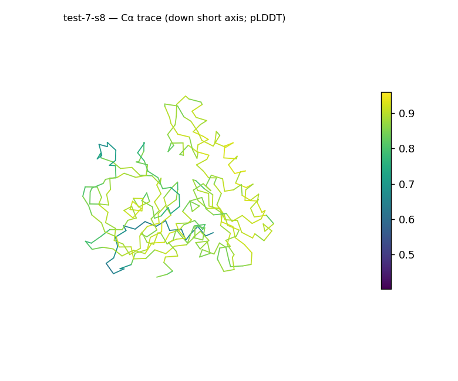
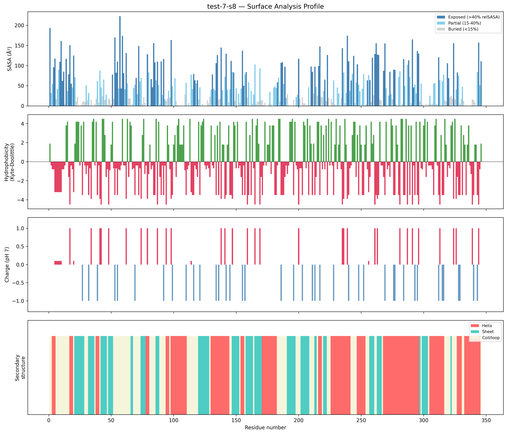
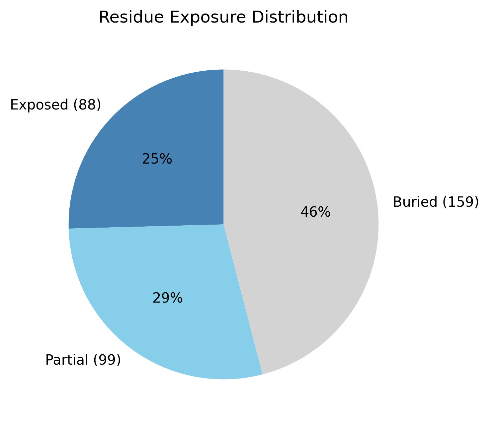

# Structural analysis — `test-7-s8`

> Facts are emitted deterministically from the measurement scripts. Sections marked with a SYNTHESIS comment are authored by the Claude session (judgment), kept visibly separate from the measured facts.

## Executive summary

`test-7-s8` is a 346-residue single chain (`parse_structure.py`) and the most textbook-globular structure in the set: roughly globular shape (asphericity 0.09, dimensions 56.8 × 53.7 × 37.3 Å), Rg 19.81 Å against ~25.9 Å expected, and an exposure distribution squarely in normal globular ranges (46.0% buried / 28.6% partial / 25.4% exposed; `surface_analysis.py`). It has the most balanced secondary structure of the batch — 41.0% helix and 26.6% sheet (32.4% coil; pydssp), both types well represented — consistent with a mixed α/β or α+β class. The surface is moderately polar and near-neutral (mean Kyte–Doolittle −1.67, net −2.6 e) with no exposed hydrophobic patches. Model confidence is high (mean pLDDT 82.08, median 85.62).

## User-provided context

No prior biological context provided.

## Structure overview

- **Source:** predicted model — pLDDT in the B-factor column
- **Chains:** 1 (single chain)
- **Residues / atoms:** 346 / 2609
- **Missing residues:** 0
- **Non-solvent ligands:** none
  - chain **A**: 346 res

## Structural views

_Cα backbone trace (Agent 2.2 matplotlib placeholder), down the long / mid / short principal axes; coloured by pLDDT._

## Shape & secondary structure

- **Shape:** roughly globular (asphericity 0.09, Rg 19.81 Å)
- **Approx. dimensions:** 56.8 × 53.7 × 37.3 Å
- **Secondary structure:** helix 41.0%, sheet 26.6%, coil 32.4% _(method: pydssp)_
- **⚠ SS assigned by pydssp (fallback), not mkdssp** — pydssp is a simplified DSSP reimplementation and can over- or under-call short helix/sheet segments on imperfect (e.g. predicted) backbones. Treat fractions near the ~5% floor, the helix/sheet split, and any coil-vs-disorder reasoning as provisional; install mkdssp for reference-grade assignment.

## Surface properties

- **Exposure:** buried 46.0%, partial 28.6%, exposed 25.4%
- **Total SASA:** 16170.2 Ų
- **Surface hydrophobicity (KD):** mean -1.67 ± 2.6
- **Surface charge (pH 7):** net -2.6 e (19 +, 18 −)
- **Hydrophobic patches:** 0

## Prediction quality / structural coherence

Confidence is **reported, never gated** — these signals are inputs for the synthesis below, not a pass/fail.

- **pLDDT (chain A):** mean 82.08, median 85.62, range 40.3–95.88, std 11.96
- **Compactness:** Rg 19.81 Å vs ~25.9 Å expected for 346 residues (2.5·N^0.4) — consistent
- **Core present:** buried fraction 46.0%
- **Coil fraction:** 32.4%

### Coherence assessment

The coherence signals agree with the confidence score (mean pLDDT 82.08, median 85.62, "confident" tier). All structural signals point the same way: Rg 19.81 Å is below the ~25.9 Å globular expectation (compact), the buried fraction is 46.0% (a solid core, mid-range for globular proteins), and the coil fraction is moderate (32.4%). The pLDDT range reaches down to 40.3 (std 11.96) — the usual minority of low-confidence loop and terminal positions — but the well-cored, compact, roughly spherical body is fully consistent with a coherent fold at this confidence level.

## Expected-parameter comparison

_No expected-parameter profile supplied — this is the default for novel / low-homology targets. See the independent observations below._

## Independent observations

Measured against a generic globular baseline, this structure is unremarkable in the most informative way: its exposure split (46.0% buried / 28.6% partial / 25.4% exposed) lands almost exactly on the textbook globular distribution, its shape is near-spherical (asphericity 0.09), and its Rg (19.81 Å) is modestly compact relative to the ~25.9 Å expectation for 346 residues. The one positive feature worth noting is the balance of secondary structure — helix and sheet both well above the presence floor (41.0% and 26.6%; pydssp) — making this the clearest mixed-class candidate in the set; whether interleaved (α/β) or segregated (α+β) cannot be told from content alone. The surface is moderately polar (mean KD −1.67), near charge-neutral (net −2.6 e, 19 +/18 −), and free of exposed hydrophobic patches. No internal inconsistencies among the signals. This is structural description only; the measurements are insufficient structural evidence to assign function.

## Methods

- **Measurements (deterministic):** `parse_structure.py` (metadata, confidence stats), `surface_analysis.py` (Shrake–Rupley SASA, Kyte–Doolittle hydrophobicity, charge at pH 7, DSSP secondary structure, shape metrics), `render_trace.py` (Agent 2.2 Cα-trace figures; `render_views.py` Mol* cartoons when Agent 2.1 is available).
- **Report facts** below the synthesis sections are emitted verbatim from the above scripts' JSON by `assemble_report.py` — no transcription.
- **Synthesis** sections (executive summary, independent observations incl. the one-line scope statement, coherence assessment) are authored by Claude per `SKILL.md` Step 9, each claim cited to a measurement.
