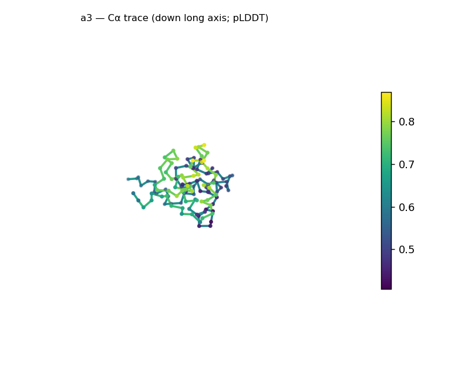
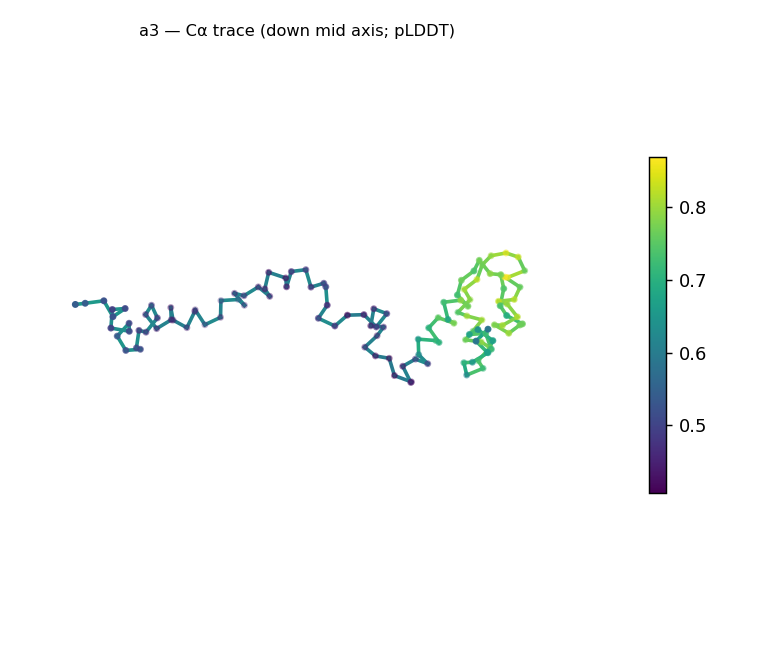
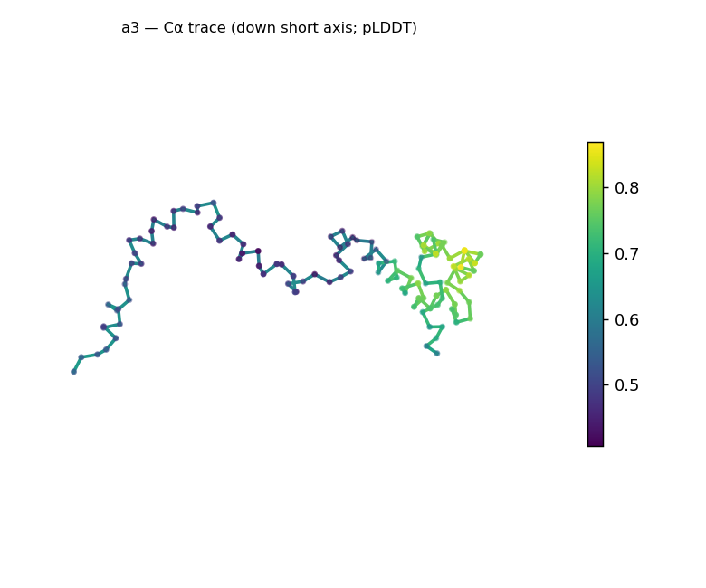
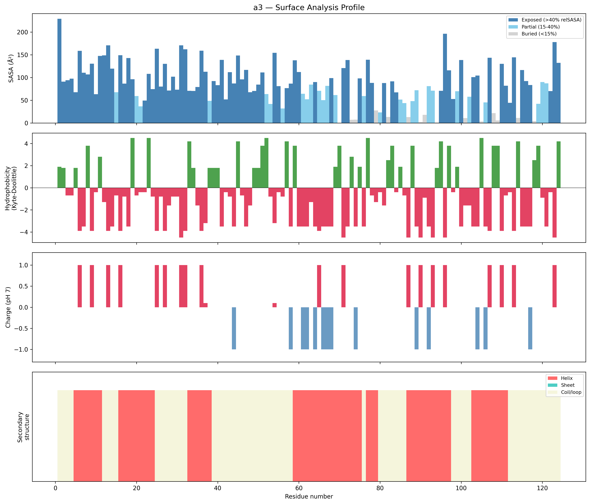
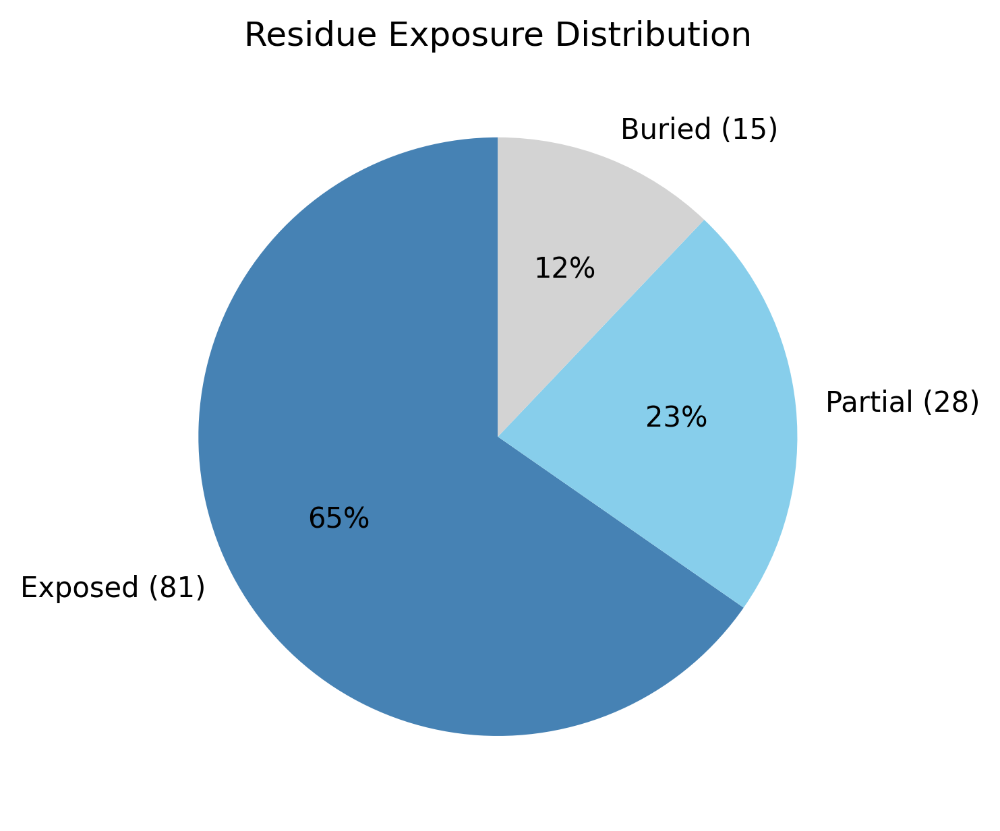

# Structural analysis — `a3`

> Facts are emitted deterministically from the measurement scripts. Sections marked with a SYNTHESIS comment are authored by the Claude session (judgment, Zone 2), kept visibly separate from the measured facts.

## Executive summary

A 124-residue predicted model that is **all-α and strongly elongated, with little sign of a packed core.** DSSP secondary structure is 50% helix / 0% sheet (50% coil); the chain is extended — asphericity 0.70, 90 Å long axis, Rg 29.7 Å versus the ~17.2 Å expected for 124 residues — with only 12.1% of residues buried and 65.3% solvent-exposed, i.e. essentially no hydrophobic core. Confidence is low across the whole chain (mean pLDDT 60.4, median 53.9, range 40.6–86.9), not a localized dip. The surface is strongly net-positive (+9.2 e; 17 positive vs 6 negative). The helical content is a real measurement, but this elongated, core-less, low-confidence model is **not** a confidently-packed globular fold — read the "all-alpha" fold call cautiously.

## User-provided context

None provided. All observations below are derived from the structure alone.

## Structure overview

- **Source:** predicted model — pLDDT in the B-factor column
- **Chains:** 1 (single chain)
- **Residues / atoms:** 124 / 966
- **Missing residues:** 0
- **Non-solvent ligands:** none
  - chain **A**: 124 res

## Structural views

_Cα backbone trace (Agent 2.2 matplotlib placeholder), down the long / mid / short principal axes; coloured by pLDDT._

## Fold & shape

- **Shape:** prolate (elongated) (asphericity 0.7, Rg 29.72 Å)
- **Approx. dimensions:** 90.2 × 37.7 × 26.6 Å
- **Secondary structure:** helix 50.0%, sheet 0.0%, coil 50.0%
- **Fold class:** all-alpha
  - generic all-alpha fold (SCOP unclassified, CATH unclassified; confidence low)

## Surface properties

- **Exposure:** buried 12.1%, partial 22.6%, exposed 65.3%
- **Total SASA:** 10625.6 Ų
- **Surface hydrophobicity (KD):** mean -0.91 ± 2.92
- **Surface charge (pH 7):** net 9.2 e (17 +, 6 −)
- **Hydrophobic patches:** 2:
  - residues 38–40 (len 3, mean KD 1.8)
  - residues 49–52 (len 4, mean KD 2.98)

## Prediction quality / structural coherence

Confidence is **reported, never gated** — these signals are inputs for the synthesis below, not a pass/fail.

- **pLDDT (chain A):** mean 60.36, median 53.94, range 40.63–86.91, std 15.02
- **Compactness:** Rg 29.72 Å vs ~17.2 Å expected for 124 residues (2.5·N^0.4) — larger than expected
- **Core present:** buried fraction 12.1%
- **Coil fraction:** 50.0%
- **Top fold-candidate confidence:** low

### Coherence assessment

This is the case where the coherence signals and the confidence score **agree that the model is uncertain** — not a low pLDDT hiding a coherent fold, but low confidence alongside structural signs of an *unpacked* model. The buried fraction is only 12.1% and Rg is 73% above the folded-globular expectation (29.7 vs ~17.2 Å), so there is no compact hydrophobic core; pLDDT is low across the whole chain (median 53.9), not a localized terminus. The 50% helix is a real DSSP measurement, but those helices are not assembled into a confidently-packed tertiary structure here. Read this as an extended / under-determined helical model: the secondary-structure content is trustworthy, the overall fold is not. (Contrast the earlier targets, where a low minimum pLDDT was a localized floppy arm on an otherwise solid, compact fold.)

## Expected-parameter comparison

_No expected-parameter profile supplied — this is the default for novel / low-homology targets. See the independent observations below._

## Independent observations

- **All-α, no sheet.** 50% helix, 0% sheet (DSSP) — purely helical secondary structure.
- **Elongated, with essentially no core.** Asphericity 0.70, 90 × 38 × 27 Å, Rg 29.7 Å (73% above the ~17.2 Å expected for 124 residues); only 12.1% buried and 65.3% exposed — far from the ≥~30% buried core of a compact globular domain. Extended + core-less + all-helical converge toward an extended helical conformation rather than a packed fold.
- **Uniformly low confidence.** pLDDT median 53.9 (range 40.6–86.9, std 15.0) — low across the chain, not one floppy segment; this *agrees with* the structural signs of an unpacked model rather than contradicting them.
- **Strongly net-positive surface.** +9.2 e (17 positive vs 6 negative surface residues) — markedly basic; two short hydrophobic patches (residues 38–40, 49–52).

## What cannot be determined from structure alone

- **Identity and function** — not established; the analysis is identity-agnostic.
- **Whether this is a genuine extended-helical fold or an under-determined prediction** — low confidence throughout *plus* the absence of a core mean this single model can't distinguish a real elongated / coiled-coil-like helical structure from a sequence the predictor simply couldn't pack. Orthogonal evidence (an MSA-based predictor, experiment, or structural homology) is needed — Agent 3.
- **Fold / topology** — only a generic "all-alpha" class at low confidence; no specific fold assignable.
- **Homology / relatives** — Agent 3 (Foldseek + literature). *Seeds:* a 124-residue all-α, strongly elongated (90 Å, Rg 29.7), core-less, net-positive (+9.2 e), low-confidence model; check whether a homolog/MSA yields a confident compact fold, and whether the elongation reflects a coiled-coil or single-helix motif.

## Methods

- **Measurements (deterministic):** `parse_structure.py` (metadata, confidence stats), `surface_analysis.py` (Shrake–Rupley SASA, Kyte–Doolittle hydrophobicity, charge at pH 7, DSSP secondary structure, shape metrics, SCOP/CATH fold class), `render_trace.py` (Agent 2.2 Cα-trace figures; `render_views.py` Mol* cartoons when Agent 2.1 is available).
- **Report facts** below the synthesis sections are emitted verbatim from the above scripts' JSON by `assemble_report.py` — no transcription.
- **Synthesis** sections (executive summary, independent observations, coherence assessment, cannot-determine) are authored by Claude per `SKILL.md` Step 9, each claim cited to a measurement.
