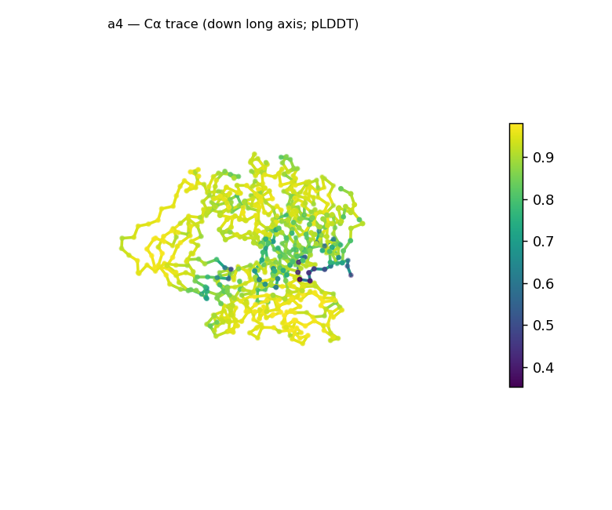
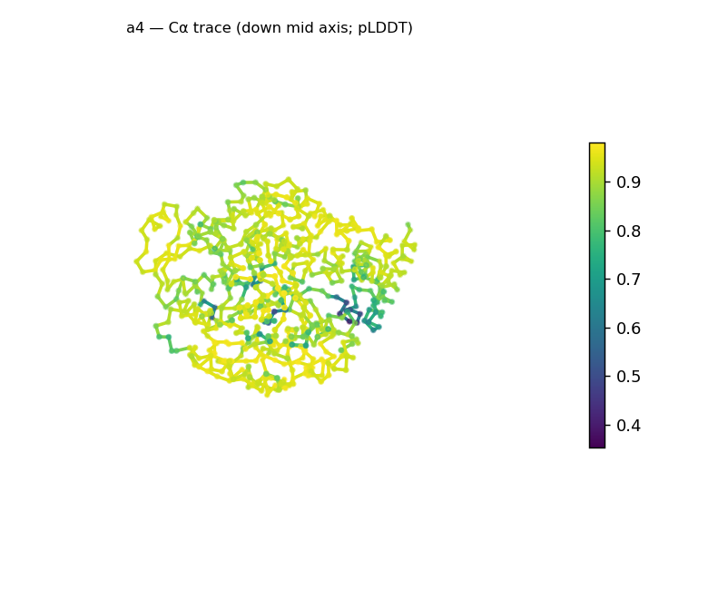
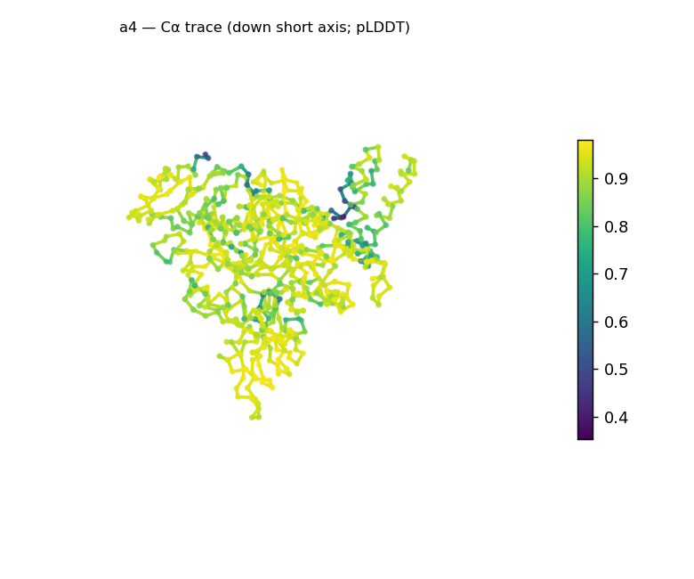
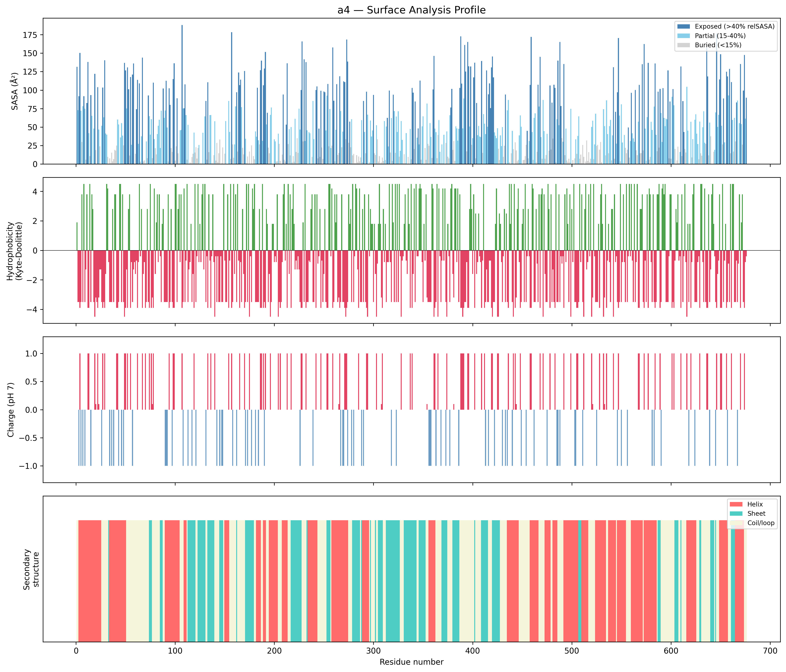
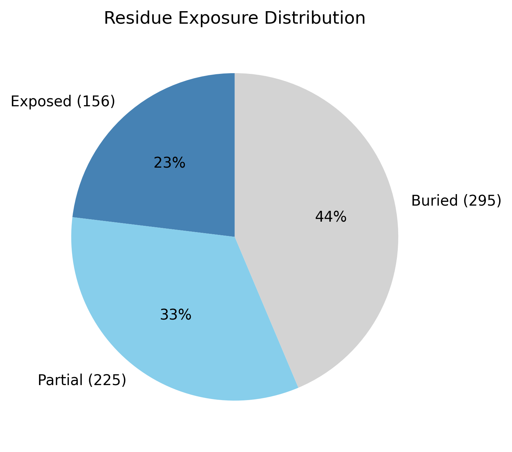

# Structural analysis — `a4`

> Facts are emitted deterministically from the measurement scripts. Sections marked with a SYNTHESIS comment are authored by the Claude session (judgment, Zone 2), kept visibly separate from the measured facts.

## Executive summary

A 676-residue predicted model that is compact, near-spherical, and confidently folded. DSSP secondary structure is mixed α/β (38.8% helix, 23.8% sheet; 37.4% coil); the chain is essentially globular (asphericity 0.01, 75 × 72 × 57 Å) and well-packed (43.6% buried — a strong hydrophobic core, the most packed of these demos), with high confidence throughout (mean pLDDT 89.1, median 92.1, std 9.5) bar one localized low-confidence segment (min 35.3). The surface is **strongly net-positive (+53 e; 69 positive vs 16 negative surface residues)** — markedly basic. One caveat governs interpretation: at 676 residues this is far larger than a single α/β domain, so the whole-chain fold call (top candidate "α/β hydrolase", high) is a **multi-domain average**, not a single-domain assignment.

## User-provided context

None provided. All observations below are derived from the structure alone.

## Structure overview

- **Source:** predicted model — pLDDT in the B-factor column
- **Chains:** 1 (single chain)
- **Residues / atoms:** 676 / 5455
- **Missing residues:** 0
- **Non-solvent ligands:** none
  - chain **A**: 676 res

## Structural views

_Cα backbone trace (Agent 2.2 matplotlib placeholder), down the long / mid / short principal axes; coloured by pLDDT._

## Fold & shape

- **Shape:** spherical/globular (asphericity 0.01, Rg 25.98 Å)
- **Approx. dimensions:** 75.2 × 71.8 × 57.4 Å
- **Secondary structure:** helix 38.8%, sheet 23.8%, coil 37.4%
- **Fold class:** alpha/beta
  - alpha/beta hydrolase (SCOP c.69, CATH 3.40.50; confidence high)
  - TIM barrel (alpha/beta barrel) (SCOP c.1, CATH 3.20.20; confidence moderate)
  - Rossmann fold (SCOP c.2, CATH 3.40.50; confidence low)

## Surface properties

- **Exposure:** buried 43.6%, partial 33.3%, exposed 23.1%
- **Total SASA:** 32506.2 Ų
- **Surface hydrophobicity (KD):** mean -2.03 ± 2.9
- **Surface charge (pH 7):** net 53 e (69 +, 16 −)
- **Hydrophobic patches:** 2:
  - residues 297–299 (len 3, mean KD 2.13)
  - residues 591–594 (len 4, mean KD 4.25)

## Prediction quality / structural coherence

Confidence is **reported, never gated** — these signals are inputs for the synthesis below, not a pass/fail.

- **pLDDT (chain A):** mean 89.06, median 92.05, range 35.32–98.06, std 9.49
- **Compactness:** Rg 25.98 Å vs ~33.9 Å expected for 676 residues (2.5·N^0.4) — consistent
- **Core present:** buried fraction 43.6%
- **Coil fraction:** 37.4%
- **Top fold-candidate confidence:** high

### Coherence assessment

The coherence signals and the confidence score agree on a **genuinely well-folded model**. Compactness is in the folded range (Rg 26.0 Å, below the ~33.9 Å expected for 676 residues), a strong hydrophobic core is present (43.6% buried — the highest of these targets), and pLDDT is high across the chain (median 92.1, std 9.5) with only a single localized low-confidence segment (min 35.3) — a confident fold with one flexible region, not a globally uncertain model. SS content (≈63% in defined H+E elements) matches the compact globular shape. The one thing the signals **cannot** underwrite is the specific fold *name*: the classifier averages SS over all 676 residues, so its single-domain candidate ("α/β hydrolase") conflates what is almost certainly a multi-domain architecture.

## Expected-parameter comparison

_No expected-parameter profile supplied — this is the default for novel / low-homology targets. See the independent observations below._

## Independent observations

- **Compact, well-packed globular model.** Mixed α/β (38.8% helix, 23.8% sheet), near-perfectly spherical (asphericity 0.01, 75 × 72 × 57 Å), Rg 26.0 Å (below the ~33.9 Å expected for 676 residues), and 43.6% buried — a strong hydrophobic core, the most packed of these targets.
- **High confidence with one localized dip.** pLDDT median 92.1 (range 35.3–98.1, std 9.5): a confident fold with a single low-confidence segment, not global uncertainty.
- **Multi-domain — the whole-chain fold class is an average.** At 676 residues the chain is far larger than a single α/β domain (~250–300 aa), so the "α/β hydrolase (high)" top candidate is a whole-structure SS-ratio average across (apparently) multiple domains, not a single-domain assignment. The reliable level is the α/β SCOP *class*; per-domain segmentation would be needed to name the actual folds.
- **Strongly basic surface.** Net +53 e at pH 7 (69 positive vs 16 negative surface residues) — a markedly positive surface; two short hydrophobic patches (residues 297–299, 591–594).

## What cannot be determined from structure alone

- **Identity and function** — not established; the analysis is identity-agnostic.
- **Per-domain folds / domain boundaries** — the whole-chain classifier averages over the (apparent) multiple domains and cannot resolve them; the "α/β hydrolase / TIM-barrel / Rossmann" candidates are not single-domain assignments for a 676-residue chain. Per-domain fold classification is Phase-2 / Agent-3 work.
- **Mechanism / what the basic surface engages** — the strongly net-positive surface (+53 e) is a structural observation, not a functional claim; whether it reflects a charged-ligand or polyanion interaction is for Agent 3 (Foldseek + literature).
- **Homology / relatives** — Agent 3. *Seeds:* a 676-residue, compact, confidently-folded multi-domain α/β protein with a strongly basic surface (+53 e); the leads are (a) segment into domains and classify each, and (b) the basic-surface / potential polyanion-binding hypothesis.

## Methods

- **Measurements (deterministic):** `parse_structure.py` (metadata, confidence stats), `surface_analysis.py` (Shrake–Rupley SASA, Kyte–Doolittle hydrophobicity, charge at pH 7, DSSP secondary structure, shape metrics, SCOP/CATH fold class), `render_trace.py` (Agent 2.2 Cα-trace figures; `render_views.py` Mol* cartoons when Agent 2.1 is available).
- **Report facts** below the synthesis sections are emitted verbatim from the above scripts' JSON by `assemble_report.py` — no transcription.
- **Synthesis** sections (executive summary, independent observations, coherence assessment, cannot-determine) are authored by Claude per `SKILL.md` Step 9, each claim cited to a measurement.
