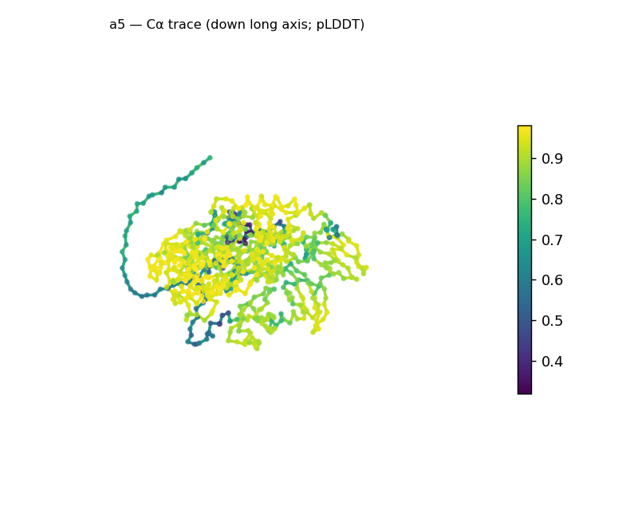
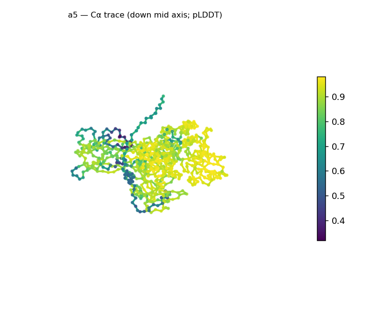
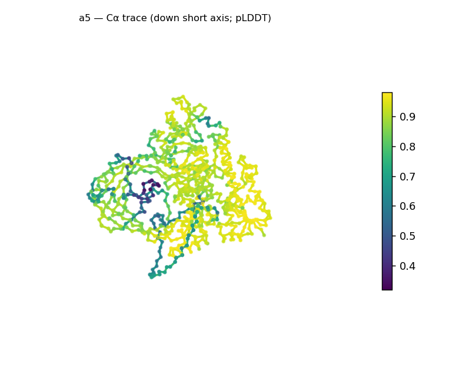
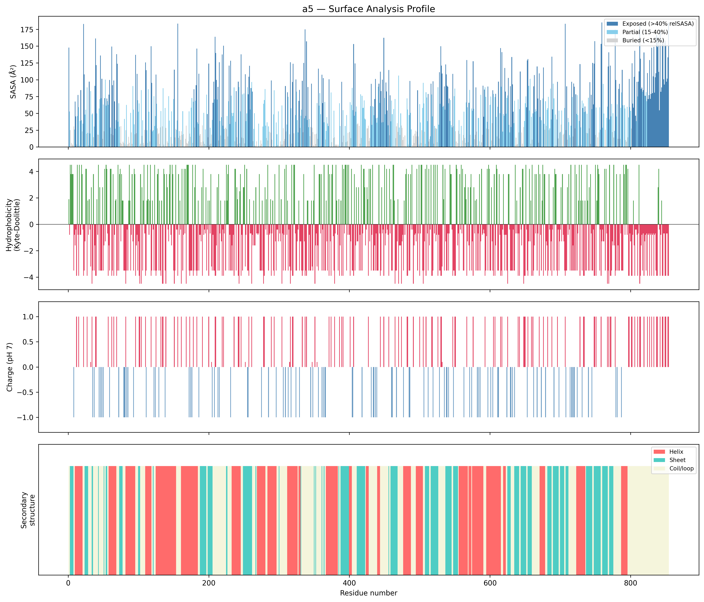
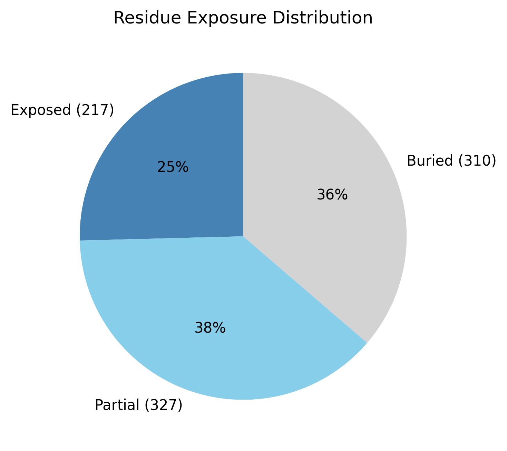

# Structural analysis — `a5`

> Facts are emitted deterministically from the measurement scripts. Sections marked with a SYNTHESIS comment are authored by the Claude session (judgment, Zone 2), kept visibly separate from the measured facts.

## Executive summary

An 854-residue predicted model: compact, roughly globular, and confidently folded, with mixed α/β secondary structure (34.2% helix, 25.2% sheet; 40.6% coil). It is well-packed (Rg 30.6 Å, below the ~37.2 Å expected for 854 residues; asphericity 0.07; 36.3% buried) and high-confidence overall (mean pLDDT 85.0, median 90.1), but with one **localized low-confidence region (min 31.9)** — consistent with a flexible or extended segment within an otherwise solid fold. The surface is strongly net-positive (+37 e; 75 positive vs 36 negative). As with any chain this size, the whole-chain fold call (top candidate "α/β hydrolase", high) is a **multi-domain average** — at 854 residues this is plainly several domains, not a single hydrolase fold.

## User-provided context

None provided. All observations below are derived from the structure alone.

## Structure overview

- **Source:** predicted model — pLDDT in the B-factor column
- **Chains:** 1 (single chain)
- **Residues / atoms:** 854 / 6828
- **Missing residues:** 0
- **Non-solvent ligands:** none
  - chain **A**: 854 res

## Structural views

_Cα backbone trace (Agent 2.2 matplotlib placeholder), down the long / mid / short principal axes; coloured by pLDDT._

## Fold & shape

- **Shape:** roughly globular (asphericity 0.07, Rg 30.62 Å)
- **Approx. dimensions:** 94.1 × 92.6 × 71.5 Å
- **Secondary structure:** helix 34.2%, sheet 25.2%, coil 40.6%
- **Fold class:** alpha/beta
  - alpha/beta hydrolase (SCOP c.69, CATH 3.40.50; confidence high)
  - TIM barrel (alpha/beta barrel) (SCOP c.1, CATH 3.20.20; confidence moderate)

## Surface properties

- **Exposure:** buried 36.3%, partial 38.3%, exposed 25.4%
- **Total SASA:** 44723 Ų
- **Surface hydrophobicity (KD):** mean -2.26 ± 2.19
- **Surface charge (pH 7):** net 37.2 e (75 +, 36 −)
- **Hydrophobic patches:** 2:
  - residues 420–422 (len 3, mean KD 3.73)
  - residues 543–545 (len 3, mean KD 4.03)

## Prediction quality / structural coherence

Confidence is **reported, never gated** — these signals are inputs for the synthesis below, not a pass/fail.

- **pLDDT (chain A):** mean 85.04, median 90.05, range 31.9–98.01, std 14.01
- **Compactness:** Rg 30.62 Å vs ~37.2 Å expected for 854 residues (2.5·N^0.4) — consistent
- **Core present:** buried fraction 36.3%
- **Coil fraction:** 40.6%
- **Top fold-candidate confidence:** high

### Coherence assessment

The signals agree on a confidently-folded model with one flexible region. Compactness is in the folded range (Rg 30.6 Å vs ~37.2 Å expected), a hydrophobic core is present (36.3% buried), and pLDDT is high across most of the chain (median 90.1) — a solid fold. The single localized low-confidence stretch (min 31.9, pulling the mean to 85.0 at std 14.0) sits *within* that fold rather than undermining it: a flexible/extended segment, not global uncertainty (the 40.6% coil is consistent with such a segment plus inter-domain linkers). The one thing the signals cannot underwrite is the specific fold *name*: the classifier averages SS over all 854 residues, so the single-domain candidate conflates what is plainly a multi-domain architecture.

## Expected-parameter comparison

_No expected-parameter profile supplied — this is the default for novel / low-homology targets. See the independent observations below._

## Independent observations

- **Large, compact, well-packed α/β model.** Mixed α/β (34.2% helix, 25.2% sheet), roughly globular (asphericity 0.07, 94 × 93 × 72 Å), Rg 30.6 Å (below the ~37.2 Å expected for 854 residues), 36.3% buried — a packed core.
- **Confident, with one localized low-confidence segment.** pLDDT median 90.1 but range 31.9–98.0 (std 14.0): a solid fold with a single flexible/extended region; the 40.6% coil is consistent with that segment plus inter-domain linkers.
- **Multi-domain — the fold class is a whole-chain average.** At 854 residues this is far beyond a single α/β domain, so the "α/β hydrolase (high)" call is an SS-ratio average across multiple domains, not a single-domain assignment. The reliable level is the α/β SCOP *class*; per-domain segmentation is needed to name the actual folds.
- **Strongly basic surface.** Net +37 e at pH 7 (75 positive vs 36 negative surface residues); two short hydrophobic patches (residues 420–422, 543–545).

## What cannot be determined from structure alone

- **Identity and function** — not established; the analysis is identity-agnostic.
- **Per-domain folds / domain boundaries** — the whole-chain classifier averages over the (apparent) multiple domains; its candidates are not single-domain assignments for an 854-residue chain. Per-domain classification is Phase-2 / Agent-3 work.
- **The nature of the low-confidence segment** — whether the min-31.9 region is a genuinely flexible/disordered stretch or simply poorly predicted is not resolvable from this single model.
- **Mechanism / what the basic surface engages** — the +37 e surface is a structural observation, not a functional claim; a charged-ligand or polyanion interaction is an Agent-3 hypothesis.
- **Homology / relatives** — Agent 3. *Seeds:* an 854-residue, compact, confidently-folded multi-domain α/β protein with a strongly basic surface (+37 e) and one localized low-confidence segment; leads are (a) segment into domains and classify each, (b) the basic-surface / polyanion-binding hypothesis.

## Methods

- **Measurements (deterministic):** `parse_structure.py` (metadata, confidence stats), `surface_analysis.py` (Shrake–Rupley SASA, Kyte–Doolittle hydrophobicity, charge at pH 7, DSSP secondary structure, shape metrics, SCOP/CATH fold class), `render_trace.py` (Agent 2.2 Cα-trace figures; `render_views.py` Mol* cartoons when Agent 2.1 is available).
- **Report facts** below the synthesis sections are emitted verbatim from the above scripts' JSON by `assemble_report.py` — no transcription.
- **Synthesis** sections (executive summary, independent observations, coherence assessment, cannot-determine) are authored by Claude per `SKILL.md` Step 9, each claim cited to a measurement.
