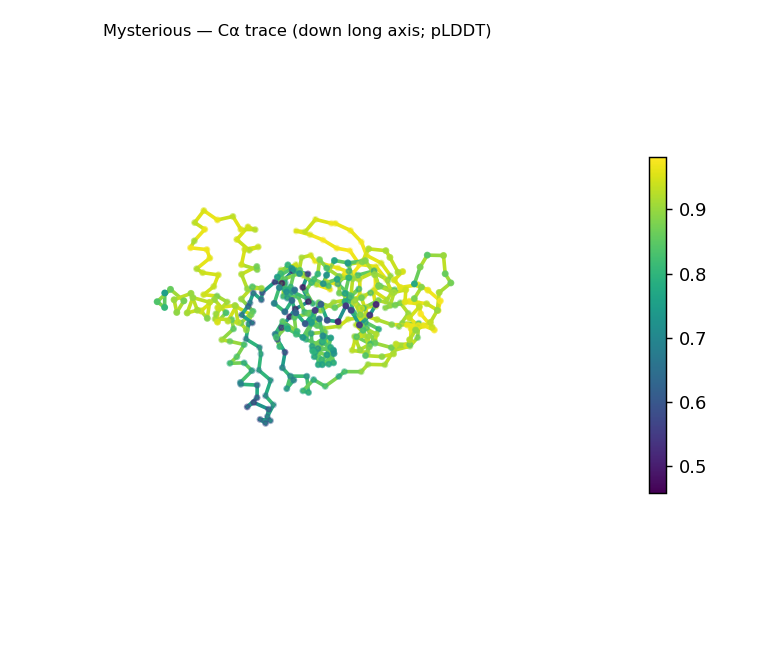
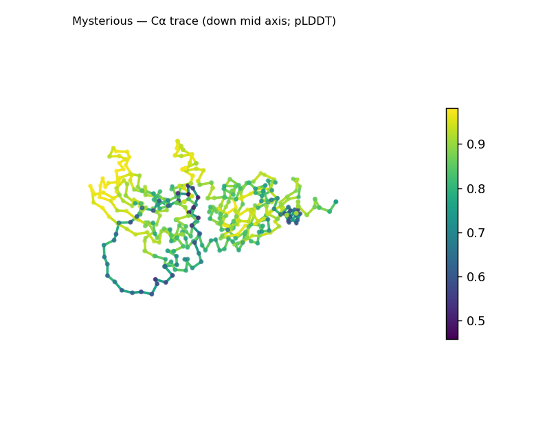
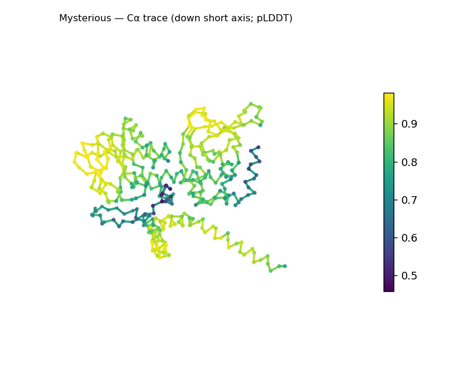
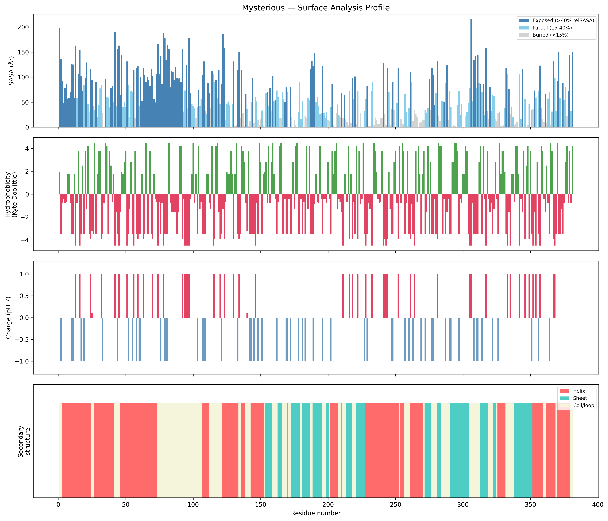
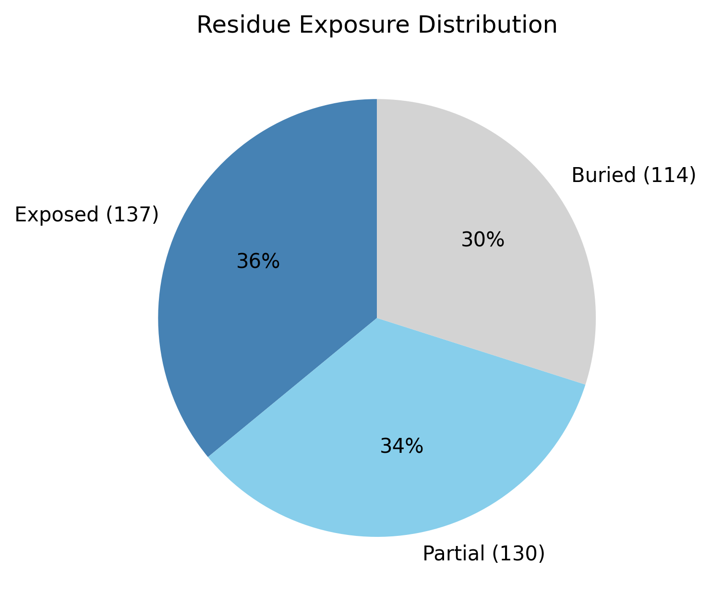

# Structural analysis — `Mysterious`

> Facts are emitted deterministically from the measurement scripts. Sections marked with a SYNTHESIS comment are authored by the Claude session (judgment, Zone 2), kept visibly separate from the measured facts.

## Executive summary

A single-chain, 381-residue predicted model with a compact α/β architecture. Real DSSP secondary structure is 44.6% helix and 22.8% sheet (32.5% coil), and the domain is compact and folded — radius of gyration 24.2 Å sits just below the ~26.9 Å expected for 381 residues, asphericity 0.13 (roughly globular). The mixed α+β content yields an α/β SCOP-class call with a top candidate of α/β hydrolase (high confidence) — but that specific candidate rests on SS content alone and is not independently verified here. Confidence is solid (mean pLDDT 82.5, median 86.1) with a modest low-confidence minority (min 45.8). The solvent-exposed surface is near charge-balanced (net +3.1 e; 29 positive vs 25 negative surface residues), with three short hydrophobic patches.

## User-provided context

None provided. All observations below are derived from the structure alone.

## Structure overview

- **Source:** predicted model — pLDDT in the B-factor column
- **Chains:** 1 (single chain)
- **Residues / atoms:** 381 / 3023
- **Missing residues:** 0
- **Non-solvent ligands:** none
  - chain **A**: 381 res

## Structural views

_Cα backbone trace (Agent 2.2 matplotlib placeholder), down the long / mid / short principal axes; coloured by pLDDT. A worm trace, not a Mol\* cartoon — true cartoons pending Agent 2.1 (#18)._

## Fold & shape

- **Shape:** roughly globular (asphericity 0.13, Rg 24.23 Å)
- **Approx. dimensions:** 75.8 × 60.4 × 46.8 Å
- **Secondary structure:** helix 44.6%, sheet 22.8%, coil 32.5%
- **Fold class:** alpha/beta
  - alpha/beta hydrolase (SCOP c.69, CATH 3.40.50; confidence high)
  - TIM barrel (alpha/beta barrel) (SCOP c.1, CATH 3.20.20; confidence moderate)
  - Rossmann fold (SCOP c.2, CATH 3.40.50; confidence low)

## Surface properties

- **Exposure:** buried 29.9%, partial 34.1%, exposed 36.0%
- **Total SASA:** 23018.8 Ų
- **Surface hydrophobicity (KD):** mean -1.46 ± 2.87
- **Surface charge (pH 7):** net 3.1 e (29 +, 25 −)
- **Hydrophobic patches:** 3:
  - residues 29–31 (len 3, mean KD 3.13)
  - residues 47–50 (len 4, mean KD 2.58)
  - residues 125–127 (len 3, mean KD 1.83)

## Prediction quality / structural coherence

Confidence is **reported, never gated** — these signals are inputs for the synthesis below, not a pass/fail.

- **pLDDT (chain A):** mean 82.5, median 86.13, range 45.75–98.15, std 12.44
- **Compactness:** Rg 24.23 Å vs ~26.9 Å expected for 381 residues (2.5·N^0.4) — consistent
- **Core present:** buried fraction 29.9%
- **Coil fraction:** 32.5%
- **Top fold-candidate confidence:** high

### Coherence assessment

The coherence signals agree with the confidence score and support a genuinely folded model. Compactness is in the folded range (Rg 24.2 Å vs ~26.9 expected) with a core present (29.9% buried) and 67% of residues in defined SS elements, so the model is neither extended nor molten. Mean pLDDT (82.5, median 86.1) is solidly medium-high; the spread (45.8–98.2, std 12.4) localizes some uncertainty without undermining the fold. Fold-level coherence holds at the *class* level — mixed α/β SS content is consistent with the compact globular shape — but the specific α/β-hydrolase candidate is a SS-ratio match with no topology or active-site corroboration here.

## Expected-parameter comparison

_No expected-parameter profile supplied — this is the default for novel / low-homology targets. See the independent observations below._

## Independent observations

- **Compact, well-structured α/β domain.** 67% of residues sit in defined SS (44.6% helix, 22.8% sheet), and Rg 24.2 Å is below the ~26.9 Å globular expectation for 381 residues — a packed, folded single domain (29.9% buried).
- **Near-neutral surface.** Net charge +3.1 e from 29 positive vs 25 negative surface residues — a balanced profile rather than a polarized one; hydrophobic surface patches are short (longest 4 residues, 47–50).
- **Fold candidate vs. evidence.** The α/β SCOP class is well-supported by the SS content; the specific "α/β hydrolase" top candidate is a SS-ratio match not corroborated by any topology or catalytic-motif check in this pipeline. Treat the class as reliable and the named fold as a hypothesis.
- **Confidence is non-uniform but high-centered** (pLDDT median 86.1, min 45.8, std 12.4): a small minority of lower-confidence positions in an otherwise well-determined model.

## What cannot be determined from structure alone

- **Identity and function** — not established; the analysis is identity-agnostic.
- **Specific fold / topology** — the α/β-hydrolase, TIM-barrel, and Rossmann candidates are SS-content matches; confirming the actual topology requires structural comparison (Foldseek) — Agent 3.
- **Active site / mechanism** — no ligands present, no catalytic machinery localized; the α/β-hydrolase fold *name* does not imply hydrolase activity or any reaction.
- **Homology / relatives** — Agent 3 (Foldseek + literature). *Seeds:* a compact ~381-residue single α/β domain (45% helix, 23% sheet), near-neutral surface (+3.1 e); verify topology against the α/β-hydrolase / TIM-barrel / Rossmann candidates.

## Methods

- **Measurements (deterministic):** `parse_structure.py` (metadata, confidence stats), `surface_analysis.py` (Shrake–Rupley SASA, Kyte–Doolittle hydrophobicity, charge at pH 7, DSSP secondary structure, shape metrics, SCOP/CATH fold class), `render_views.py` (Mol* cartoon renders).
- **Report facts** below the synthesis sections are emitted verbatim from the above scripts' JSON by `assemble_report.py` — no transcription.
- **Synthesis** sections (executive summary, independent observations, coherence assessment, cannot-determine) are authored by Claude per `SKILL.md` Step 9, each claim cited to a measurement.
