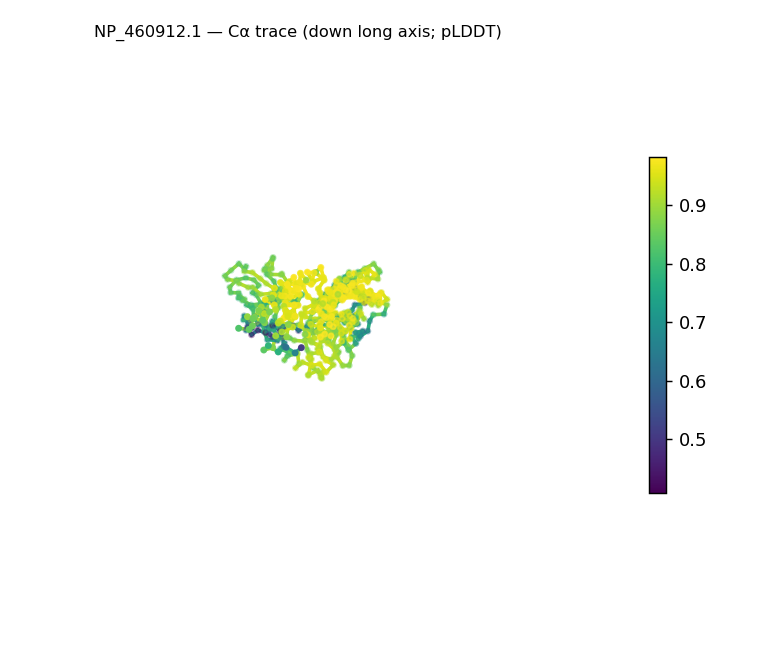
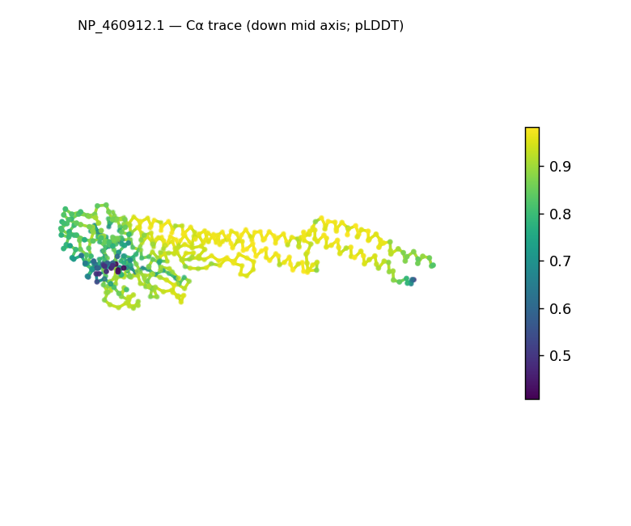
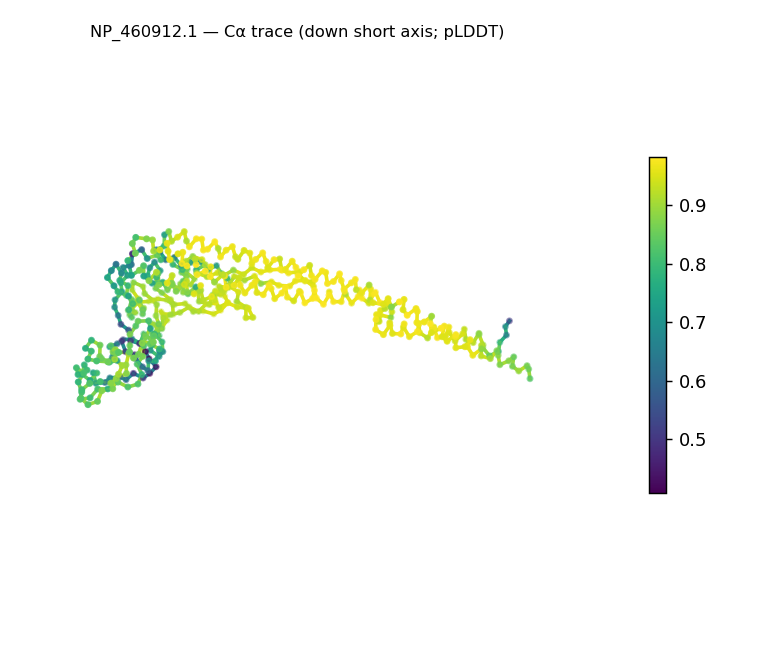
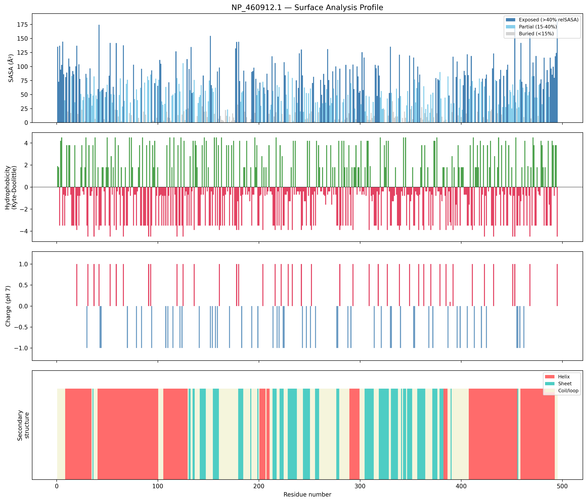
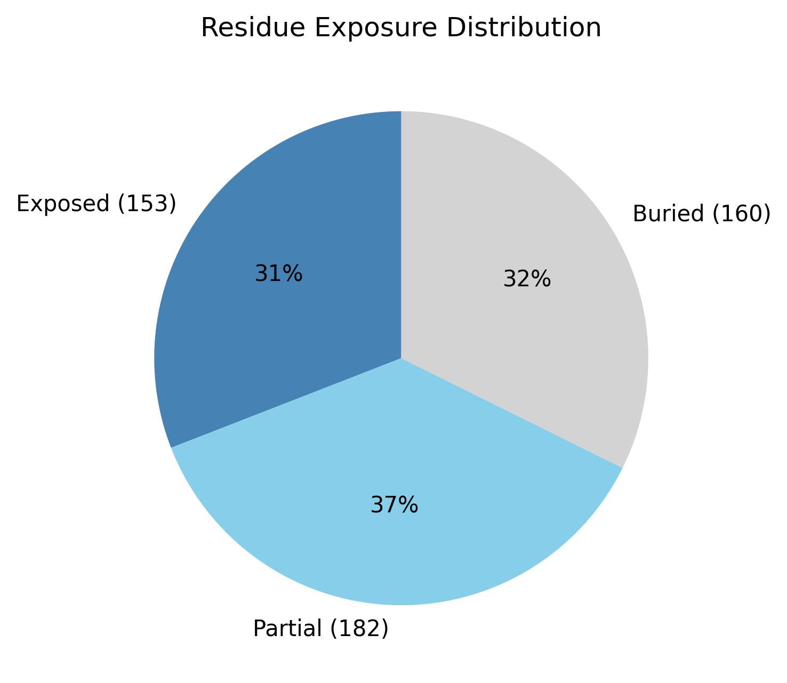

# Structural analysis — `NP_460912.1`

> Facts are emitted deterministically from the measurement scripts. Sections marked with a SYNTHESIS comment are authored by the Claude session (judgment, Zone 2), kept visibly separate from the measured facts.

## Executive summary

A single-chain, 495-residue predicted model that is strikingly elongated: asphericity 0.63 and radius of gyration 41.5 Å (≈39% above the ~29.9 Å expected for 495 residues), with a 148.9 Å long axis (≈3.6:1 long:short). It is nonetheless well-structured — real DSSP secondary structure is 43.4% helix and 22.0% sheet (65% in defined elements) — so the elongation reflects an extended, multi-segment architecture, not disorder. Confidence is high (mean pLDDT 86.3, median 90.0). One internal inconsistency is worth flagging: the SS-based top fold candidate (α/β hydrolase, a compact globular fold) does not fit the measured elongation and should be treated with caution. The solvent-exposed surface is net-positive (+8 e; 20 positive vs 12 negative surface residues).

## User-provided context

None provided. All observations below are derived from the structure alone.

## Structure overview

- **Source:** predicted model — pLDDT in the B-factor column
- **Chains:** 1 (single chain)
- **Residues / atoms:** 495 / 3622
- **Missing residues:** 0
- **Non-solvent ligands:** none
  - chain **A**: 495 res

## Structural views

_Cα backbone trace (Agent 2.2 matplotlib placeholder), down the long / mid / short principal axes; coloured by pLDDT. A worm trace, not a Mol\* cartoon — true cartoons pending Agent 2.1 (#18)._

## Fold & shape

- **Shape:** prolate (elongated) (asphericity 0.63, Rg 41.52 Å)
- **Approx. dimensions:** 148.9 × 56.5 × 41.9 Å
- **Secondary structure:** helix 43.4%, sheet 22.0%, coil 34.5%
- **Fold class:** alpha/beta
  - alpha/beta hydrolase (SCOP c.69, CATH 3.40.50; confidence high)
  - TIM barrel (alpha/beta barrel) (SCOP c.1, CATH 3.20.20; confidence moderate)
  - Rossmann fold (SCOP c.2, CATH 3.40.50; confidence low)

## Surface properties

- **Exposure:** buried 32.3%, partial 36.8%, exposed 30.9%
- **Total SASA:** 25235.2 Ų
- **Surface hydrophobicity (KD):** mean -1.05 ± 2.59
- **Surface charge (pH 7):** net 8 e (20 +, 12 −)
- **Hydrophobic patches:** 1:
  - residues 479–481 (len 3, mean KD 3.27)

## Prediction quality / structural coherence

Confidence is **reported, never gated** — these signals are inputs for the synthesis below, not a pass/fail.

- **pLDDT (chain A):** mean 86.33, median 90.04, range 40.8–98.2, std 12
- **Compactness:** Rg 41.52 Å vs ~29.9 Å expected for 495 residues (2.5·N^0.4) — larger than expected
- **Core present:** buried fraction 32.3%
- **Coil fraction:** 34.5%
- **Top fold-candidate confidence:** high

### Coherence assessment

The confidence signals indicate a genuinely folded, well-determined model (mean pLDDT 86.3, median 90.0, std 12) with a buried core (32.3%) and 65% of residues in defined SS — not molten or disordered despite the large radius of gyration. The elevated Rg (41.5 Å vs ~29.9 expected) is explained by genuine elongation (asphericity 0.63, 148.9 Å long axis), not by lack of structure. Fold-level coherence is only partial, though: the SS content earns an α/β class call, but the specific α/β-hydrolase top candidate describes a *compact globular* domain that is inconsistent with the elongation measured here — shape and named fold disagree, so the candidate is unreliable. The α/β SCOP class (from SS content) is the defensible call.

## Expected-parameter comparison

_No expected-parameter profile supplied — this is the default for novel / low-homology targets. See the independent observations below._

## Independent observations

- **Strongly elongated, yet folded.** Asphericity 0.63, Rg 41.5 Å (≈39% over the ~29.9 Å globular expectation), 148.9 × 56.5 × 41.9 Å — but 65% of residues sit in defined SS (43.4% helix, 22.0% sheet), so this is an extended fold, not an unfolded chain.
- **Internal inconsistency: shape vs. fold candidate.** The classifier's top candidate (α/β hydrolase — a compact globular fold) contradicts the measured elongation. Together the two signals flag that the SS-ratio fold *name* does not capture this architecture; only the α/β SCOP class is defensible.
- **High, fairly uniform confidence** (pLDDT median 90.0, std 12, min 40.8) — the elongation is a confident structural feature, not a low-confidence artifact.
- **Net-positive surface** (+8 e; 20 positive vs 12 negative) with essentially one short hydrophobic patch (residues 479–481) — most hydrophobicity is buried.

## What cannot be determined from structure alone

- **Identity and function** — not established; the analysis is identity-agnostic.
- **Fold / architecture** — the elongated shape is inconsistent with the compact α/β-hydrolase candidate; resolving the true architecture (e.g. extended multi-domain or coiled-coil-containing) needs structural comparison — Agent 3 (Foldseek).
- **Mechanism / active site** — none assessed; no ligands; the fold name implies no function.
- **Homology / relatives** — Agent 3. *Seeds:* a confidently-folded but strongly elongated ~495-residue chain (148.9 Å long, asphericity 0.63), 43% helix, net-positive surface (+8 e); the elongation + helical content is the structural signature to match.

## Methods

- **Measurements (deterministic):** `parse_structure.py` (metadata, confidence stats), `surface_analysis.py` (Shrake–Rupley SASA, Kyte–Doolittle hydrophobicity, charge at pH 7, DSSP secondary structure, shape metrics, SCOP/CATH fold class), `render_views.py` (Mol* cartoon renders).
- **Report facts** below the synthesis sections are emitted verbatim from the above scripts' JSON by `assemble_report.py` — no transcription.
- **Synthesis** sections (executive summary, independent observations, coherence assessment, cannot-determine) are authored by Claude per `SKILL.md` Step 9, each claim cited to a measurement.
