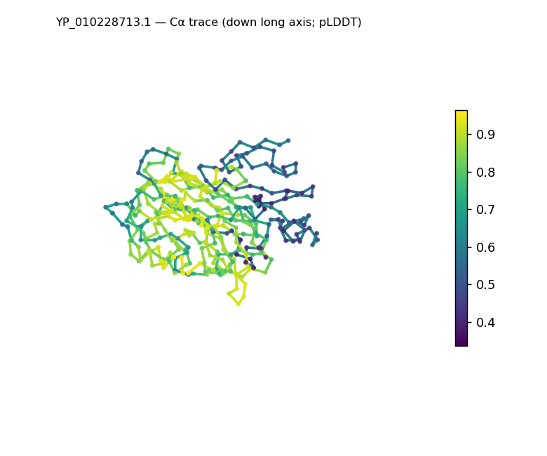
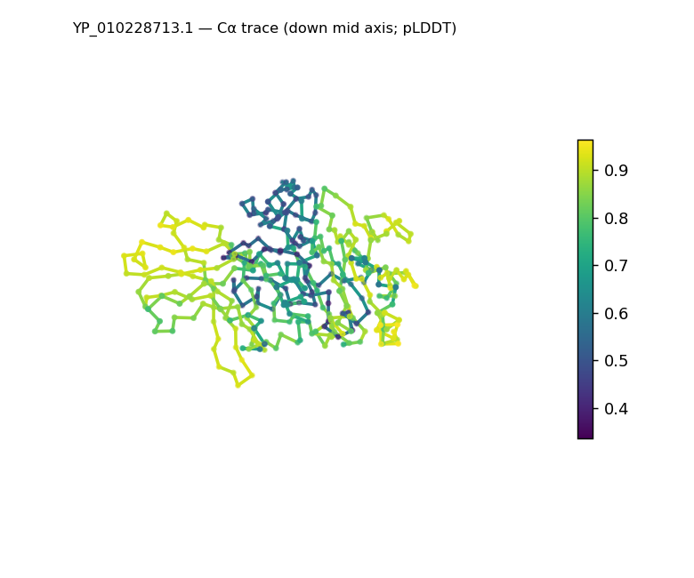
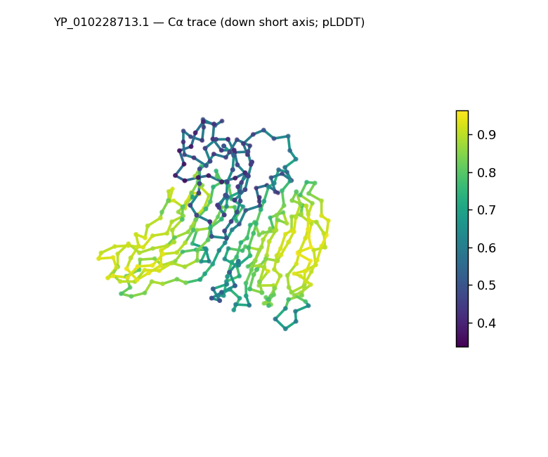
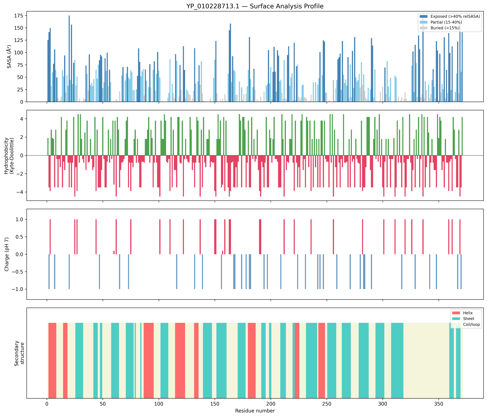
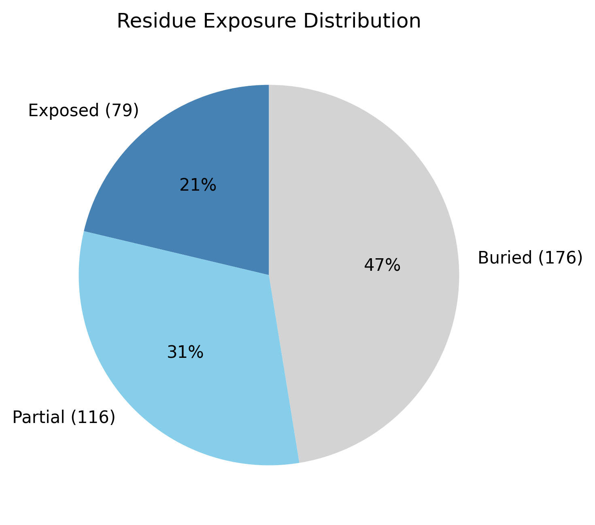

# Structural analysis — `YP_010228713.1`

> Facts are emitted deterministically from the measurement scripts. Sections marked with a SYNTHESIS comment are authored by the Claude session (judgment, Zone 2), kept visibly separate from the measured facts.

## Executive summary

A single-chain, 371-residue predicted model that is compact and sheet-dominated: real DSSP secondary structure is 36.4% sheet versus only 13.5% helix (50.1% coil), and the domain is tightly packed (Rg 19.7 Å, below the ~26.6 Å expected; asphericity 0.06, roughly spherical; 47.4% buried — the strongest core of the set). The sheet-over-helix content places it in the α+β class, and the classifier appropriately returns only a low-confidence generic α+β call rather than a named fold. Confidence is the lowest of the three (mean pLDDT 72.1, median 79.0, std 19.2, min 33.6), with uncertainty concentrated in a subset of regions. The solvent-exposed surface is slightly acidic (net −2 e; 10 positive vs 12 negative surface residues).

## User-provided context

None provided. All observations below are derived from the structure alone.

## Structure overview

- **Source:** predicted model — pLDDT in the B-factor column
- **Chains:** 1 (single chain)
- **Residues / atoms:** 371 / 2825
- **Missing residues:** 0
- **Non-solvent ligands:** none
  - chain **A**: 371 res

## Structural views

_Cα backbone trace (Agent 2.2 matplotlib placeholder), down the long / mid / short principal axes; coloured by pLDDT. A worm trace, not a Mol\* cartoon — true cartoons pending Agent 2.1 (#18)._

## Fold & shape

- **Shape:** roughly globular (asphericity 0.06, Rg 19.71 Å)
- **Approx. dimensions:** 57.3 × 52.5 × 41.3 Å
- **Secondary structure:** helix 13.5%, sheet 36.4%, coil 50.1%
- **Fold class:** alpha+beta
  - generic alpha+beta fold (SCOP unclassified, CATH unclassified; confidence low)

## Surface properties

- **Exposure:** buried 47.4%, partial 31.3%, exposed 21.3%
- **Total SASA:** 15005.9 Ų
- **Surface hydrophobicity (KD):** mean -1.38 ± 2.57
- **Surface charge (pH 7):** net -2 e (10 +, 12 −)
- **Hydrophobic patches:** 2:
  - residues 70–72 (len 3, mean KD 3.27)
  - residues 217–219 (len 3, mean KD 2.7)

## Prediction quality / structural coherence

Confidence is **reported, never gated** — these signals are inputs for the synthesis below, not a pass/fail.

- **pLDDT (chain A):** mean 72.11, median 78.99, range 33.56–96.37, std 19.17
- **Compactness:** Rg 19.71 Å vs ~26.6 Å expected for 371 residues (2.5·N^0.4) — consistent
- **Core present:** buried fraction 47.4%
- **Coil fraction:** 50.1%
- **Top fold-candidate confidence:** low

### Coherence assessment

The coherence signals indicate a folded model despite the lowest confidence in the set. A packed core is present (47.4% buried — the highest of the three) and the structure is compact (Rg 19.7 Å, asphericity 0.06), with ~50% of residues in defined SS (predominantly sheet) — so the 50.1% coil reflects the loop/turn-rich character of a β-dominated fold, not disorder. The pLDDT is moderate and notably uneven (mean 72.1, range 33.6–96.4, std 19.2): a well-determined β core with several lower-confidence segments. The classifier's cautious generic-α+β (low) call is consistent with this evidence — sheet-rich content without a confidently identifiable named topology. This is the low-homology pattern where a coherent fold can sit alongside a lower mean confidence.

## Expected-parameter comparison

_No expected-parameter profile supplied — this is the default for novel / low-homology targets. See the independent observations below._

## Independent observations

- **Compact, sheet-dominant fold.** 36.4% sheet vs 13.5% helix with a packed core (47.4% buried) and Rg 19.7 Å (below the ~26.6 Å expectation) — a tightly packed β-rich domain, the most compact of the three.
- **Loop-rich but not disordered.** 50.1% coil is high, but the strong buried core and substantial sheet content distinguish this from a disordered chain — the coil is the turn/loop content typical of β-rich folds, not absence of structure.
- **Lowest and most variable confidence** (pLDDT mean 72.1, std 19.2, min 33.6) — and appropriately the fold classifier withholds a named fold (generic α+β, low). The reliable statement is the α+β class and the sheet-rich character, not a specific topology.
- **Slightly acidic surface** (net −2 e; 10 positive vs 12 negative), with two short hydrophobic patches (residues 70–72, 217–219).

## What cannot be determined from structure alone

- **Identity and function** — not established; the analysis is identity-agnostic.
- **Specific fold / topology** — only a generic α+β class is assigned (low confidence); identifying a β-rich fold needs structural comparison — Agent 3 (Foldseek).
- **Mechanism / binding** — no ligands; nothing assessed.
- **Homology / relatives** — Agent 3. *Seeds:* a compact, sheet-dominant (~36% sheet, 14% helix) ~371-residue α+β domain with a packed core and locally lower confidence (min pLDDT 33.6); the β-rich signature is the match target.

## Methods

- **Measurements (deterministic):** `parse_structure.py` (metadata, confidence stats), `surface_analysis.py` (Shrake–Rupley SASA, Kyte–Doolittle hydrophobicity, charge at pH 7, DSSP secondary structure, shape metrics, SCOP/CATH fold class), `render_views.py` (Mol* cartoon renders).
- **Report facts** below the synthesis sections are emitted verbatim from the above scripts' JSON by `assemble_report.py` — no transcription.
- **Synthesis** sections (executive summary, independent observations, coherence assessment, cannot-determine) are authored by Claude per `SKILL.md` Step 9, each claim cited to a measurement.
