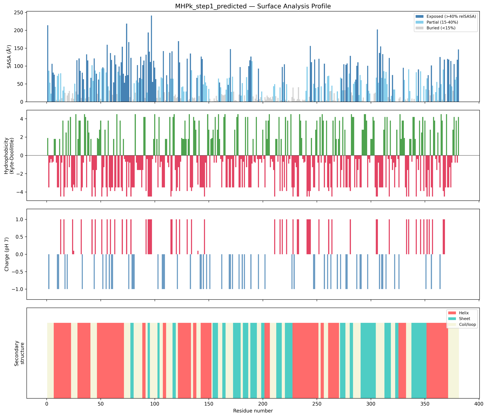
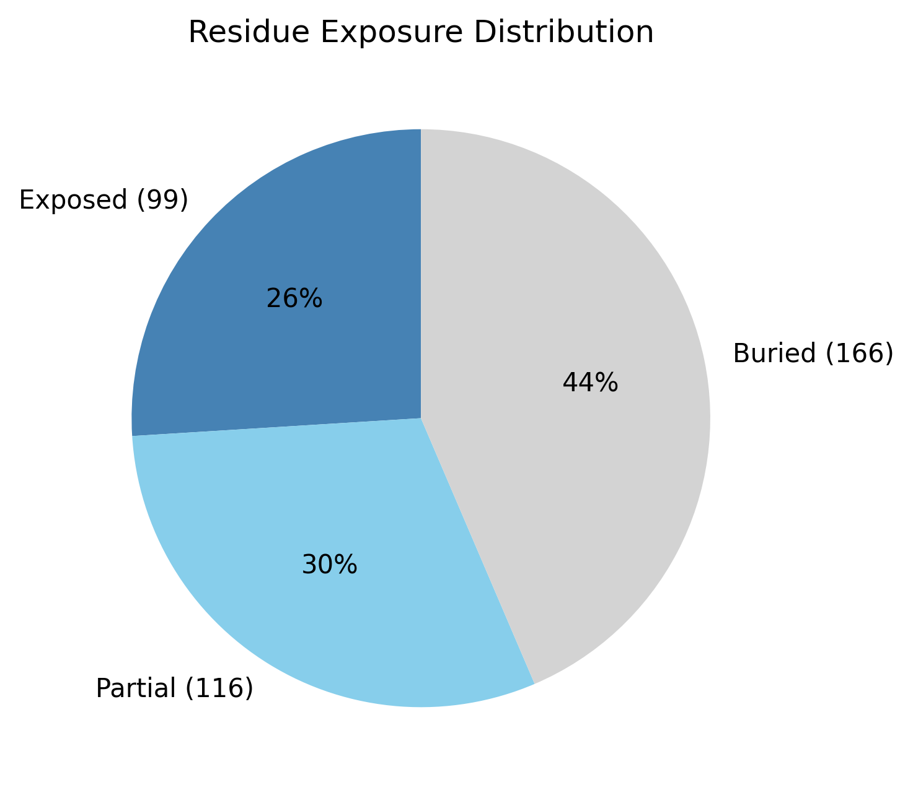

# Agent 2 — Deterministic Structural Description

**Input:** `MHPk_step1_predicted.cif` (single structure)
**Run date:** 2026-05-04
**Pipeline:** `parse_structure` → `surface_analysis` → disorder gate → `binding_site` (no-op, no ligands)

> No biological context was provided. The filename (`MHPk`) and the Agent 1
> sidecar header ("Mysterious human protein 1") are opaque labels — they did
> not inform any analysis below. Findings are descriptive only (Zone 1 +
> Zone 2). No identification or function inference (Zone 3).

---

## Agent 1 metadata (passthrough)

From `MHPk_step1_result.json`, forwarded unmodified — does not influence
geometric measurements.

| Field | Value |
|---|---|
| Predictor | Boltz-2 v2.2.1 |
| Sequence length | 381 aa |
| Stoichiometry | 1 (monomer) |
| MSA used | no |
| Recycling / sampling steps | 3 / 200 |
| `complex_plddt` | 0.64 |
| `ptm` | 0.40 |
| `iptm` | 0 (expected for single chain) |
| `confidence_score` | 0.59 |
| Runtime | 207 s |

Modest overall confidence. pTM < 0.5 → topology not over-trustworthy.

---

## Zone 1 — Geometric measurements

| Metric | Value |
|---|---|
| Chains / residues / atoms | 1 / 381 / 3023 |
| Chain breaks, missing residues | 0 / 0 |
| Total SASA | 19 214 Ų |
| Buried / partial / exposed | 44 % / 30 % / 26 % |
| Radius of gyration | 23.5 Å (empirical for globular ≈ 26.8 Å → **more compact**) |
| Asphericity | 0.27 |
| Approximate dimensions | 75.6 × 49.0 × 41.0 Å (axis ratios 3.81 / 4.69) |
| Surface net charge | 0 (21 exposed Arg/Lys, 21 exposed Asp/Glu) |
| Mean surface hydrophobicity | −1.86 (typical soluble globular) |
| Per-residue pLDDT | mean 63.9, median 66.6, range 26.3 – 95.6, σ 19.0 |

Per-residue SASA, hydrophobicity, charge, and SS in the companion CSV
(`MHPk_step1_predicted_surface.csv`, 381 rows).

---

## Zone 2 — Spatial patterns

- **Secondary structure:** 40.2 % helix, 25.2 % sheet, 34.6 % coil. Mixed α/β.
- **Shape:** prolate (elongated). Long axis ~75 Å; axis ratio ~3.8 — clearly non-spherical.
- **Hydrophobic surface patches:** two small, residues 29–31 and 125–127
  (3 residues each, mean Kyte-Doolittle 3.13 and 1.83). Not extensive.
- **Fold candidates** (script SS-signature heuristic):
  - α/β hydrolase (SCOP c.69, CATH 3.40.50) — script labelled "high".
  - TIM barrel / (β/α)₈ (SCOP c.1, CATH 3.20.20) — script labelled "moderate".

**Caveat on fold labels.** The script's "high / moderate" confidence comes from
SS-fraction matching only — no topology check. The two candidates are
mutually exclusive folds, and the script reports both without resolving.
Definitive fold assignment requires Dali / FoldSeek / SCOP-class structural
search, which is Agent 3 territory. Treat this as a Zone-2 *hint*: the
structure is α/β, prolate, with mixed SS typical of an α/β domain. Not a
fold call.

---

## Figures



*Surface profile across the 381-residue chain. Top to bottom: per-residue SASA,
Kyte-Doolittle hydrophobicity, charge at pH 7, secondary-structure strip.*



*Per-residue exposure category. Buried 44 %, partial 30 %, exposed 26 % —
clear buried core.*

---

## Disorder gate — PASS

Indicators converge on "folded":

| Indicator | Value | Disorder threshold | Verdict |
|---|---|---|---|
| Coil fraction | 35 % | > 80 % | folded |
| Buried fraction | 44 % | < 30 % | folded |
| Rg vs. empirical | 23.5 / 26.8 Å (0.88×) | Rg ≫ expected | folded |
| Missing residues | 0 / 381 | > 30 % | n/a (predicted) |
| Hydrophobic patches | 2 small | absent | folded |

Proceed normally.

---

## Binding sites — none

`MHPk_step1_predicted_binding_sites.json`: zero non-solvent ligands.
Boltz-2 does not predict ligand positions, so this is **uninformative**
about whether the protein binds ligands biologically. It just means the
predicted file has no ligand atoms.

---

## Red flags / caveats

1. **Whole-chain fold classification on a 381-residue prolate structure
   is suspect.** Axis ratio 3.8 + asphericity 0.27 is consistent with a
   multi-domain architecture. The script averages SS content over the
   whole chain, which the README flags as unreliable for multi-domain
   inputs. Per-domain re-analysis is owed (Phase 2 / Agent 3).
2. **Modest prediction confidence.** Mean pLDDT 64 sits in the 50–70
   "low confidence — fold may be correct but details unreliable" band.
   Wide range (26–96, σ 19) → substantial regional variation. Some
   segments confidently predicted, others not.
3. **pTM 0.40.** Topology confidence is modest. Whole-fold inferences
   should be hedged accordingly.
4. **Predicted monomer, no ligands modelled.** Per the AlphaFold-specific
   guidance: do not infer oligomeric state or ligand-binding capacity
   from this prediction alone.

---

## Phase 2 follow-ups available

- Re-run `surface_analysis` per chain segment to test the multi-domain
  hypothesis (the prolate shape suggests two or more domains arranged
  end-to-end).
- pLDDT-stratified re-analysis — segregate residues by confidence tier
  and re-evaluate fold/SS over only the well-predicted core.
- If you provide biological context (organism, suspected family, what
  you're looking for), structural observations can be routed into a
  literature search and any checkable claims validated against the data
  above.

---

## Output files on disk

```
src/agent_1/step1_results/agent2_out/
├── MHPk_step1_predicted_metadata.json          1.3 KB
├── MHPk_step1_predicted_surface_analysis.json  2.3 KB
├── MHPk_step1_predicted_surface.csv           14.8 KB  (381 rows)
├── MHPk_step1_predicted_surface_profile.png  216 KB
├── MHPk_step1_predicted_exposure_pie.png      73 KB
├── MHPk_step1_predicted_binding_sites.json    77 B
├── MHPk_step1_predicted_report.md             this file
└── MHPk_step1_predicted_report.html           single-file HTML view
```
